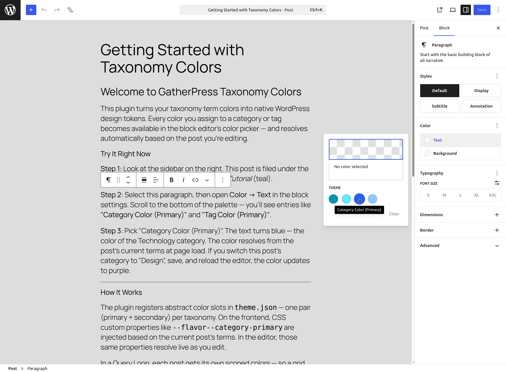
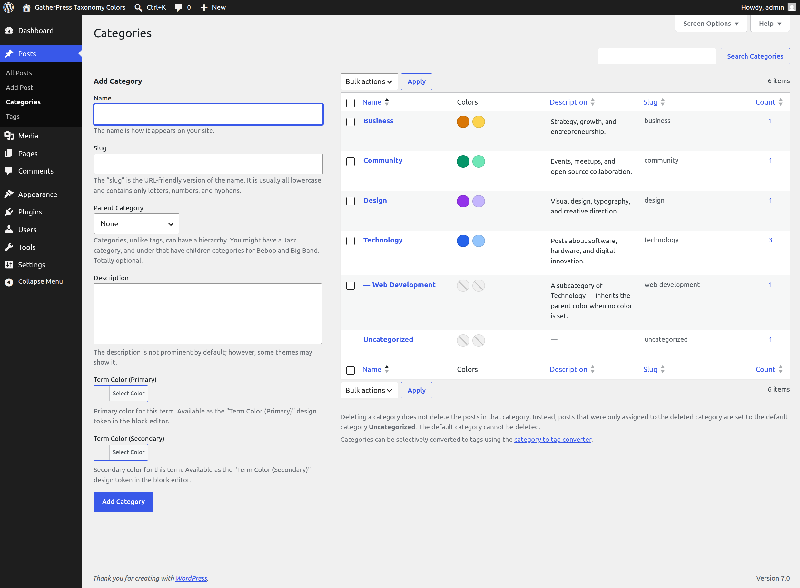
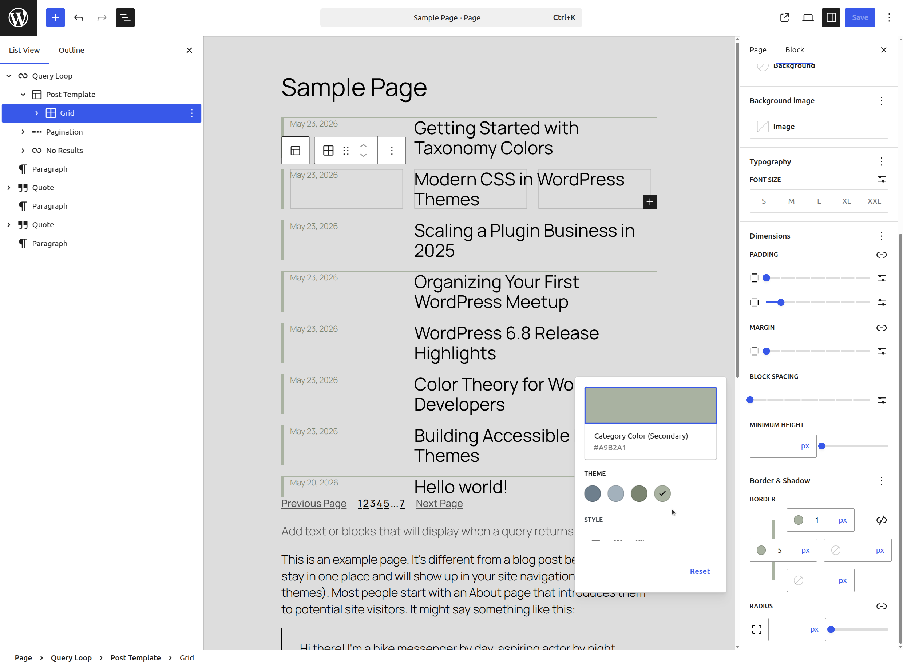
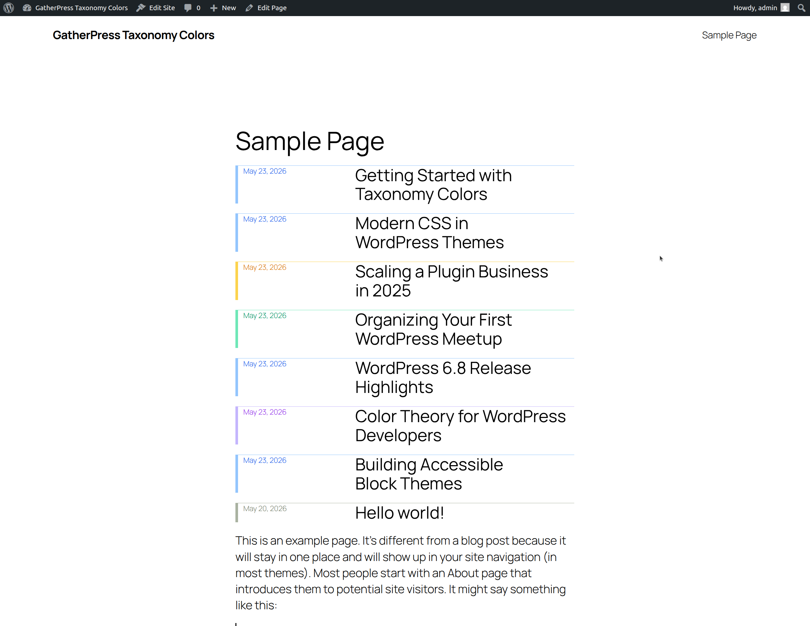

# GatherPress Taxonomy Colors

**Contributors:** Carsten Bach  
**Tags:** taxonomy, colors, design tokens, theme.json, custom properties  
**Requires at least:** 6.4  
**Tested up to:** 6.8  
**Requires PHP:** 7.4  
**Stable tag:** 0.2.0  
**License:** GPLv2 or later  
**License URI:** https://www.gnu.org/licenses/gpl-2.0.html  

[](https://playground.wordpress.net/?blueprint-url=https://raw.githubusercontent.com/carstingaxion/gatherpress-taxonomy-colors/main/.wordpress-org/blueprints/blueprint.json) [](https://github.com/carstingaxion/gatherpress-taxonomy-colors/actions/workflows/build-test-measure.yml)


Assign colors to taxonomy terms and use them as native design tokens in the block editor — resolved contextually per post, per archive, and per Query Loop item.

## Description

GatherPress Taxonomy Colors turns term colors into first-class WordPress design tokens. Assign a primary and secondary color to any taxonomy term, and those colors appear in the block editor's color picker alongside your theme palette — resolved dynamically based on post context.

|  |   |
|---|---|
|   |   |


### How It Works

The plugin implements a 6-layer architecture that integrates with WordPress's existing design token system:

1. **Term Meta** — Colors stored as term meta via `register_term_meta()` with full REST API visibility. The number of color roles is fully flexible via the `gptc_term_color_roles` filter (defaults to primary + secondary).
2. **Design Tokens** — Abstract color slots injected into `theme.json` per taxonomy per role, with CSS custom property indirection to work around core's palette sanitizer.
3. **Frontend Resolution** — Contextual `--flavor--` custom properties on `:root` based on the current post's terms or the queried archive term.
4. **Editor Resolution** — The same colors resolve inside the block editor when editing a post, so color picker swatches match the frontend.
5. **Scoped Resolution** — In Query Loop and archive contexts, per-post colors are scoped directly onto each `<li>` element via `WP_HTML_Tag_Processor` — no wrapper divs, no broken grid layouts.
6. **Shadow Taxonomy Support** — Post types using GatherPress's shadow taxonomy pattern (where each post is mirrored by a hidden term) get color pickers on the post editor and automatic design token generation.

### Key Features

- **Native integration** — Colors appear in the standard block editor color picker. Any block that supports color attributes can use them.
- **Per-taxonomy slots** — A post in category "Technology" (blue) and tagged "Breaking" (red) resolves both colors independently.
- **Query Loop aware** — Each post in a Query Loop renders with its own term colors, not just the last one resolved.
- **Shadow taxonomy support** — Works with GatherPress's shadow taxonomy pattern for post types acting as quasi-taxonomies.
- **Flexible color roles** — The `gptc_term_color_roles` filter lets theme authors define any number of color roles per term (e.g., `primary`, `secondary`, `accent`, `base`). All layers derive from this single source of truth.
- **Fully filterable** — `gptc_term_color_taxonomies` controls which taxonomies participate. `gptc_term_color_slots` controls the design token definitions. `gptc_term_color_roles` controls color roles per term.
- **Zero configuration** — Install, activate, and assign colors to your terms. The design tokens are generated automatically.

## Installation

1. Upload the `gatherpress-taxonomy-colors` folder to `/wp-content/plugins/`.
2. Activate the plugin through the **Plugins** menu in WordPress.
3. Navigate to any taxonomy term edit screen (e.g., **Posts → Categories → Edit**) to assign primary and secondary colors.
4. In the block editor, open any block's color settings — the term color tokens appear in the palette.

## Frequently Asked Questions

### Which taxonomies are supported?

By default, `category` and `post_tag`. Use the `gptc_term_color_taxonomies` filter to add custom taxonomies:

```php
add_filter( 'gptc_term_color_taxonomies', function ( $taxonomies ) {
    $taxonomies[] = 'genre';
    return $taxonomies;
} );
```

### Can I add more than two colors per term?

Yes. Use the `gptc_term_color_roles` filter to define additional color roles:

```php
add_filter( 'gptc_term_color_roles', function ( $roles ) {
    $roles[] = array(
        'slug'     => 'accent',
        'label'    => 'Accent',
        'meta_key' => 'term_color_accent',
    );
    $roles[] = array(
        'slug'     => 'accent-dark',
        'label'    => 'Accent Dark',
        'meta_key' => 'term_color_accent_dark',
    );
    return $roles;
} );
```

Each role gets its own term meta key, design token slot, and CSS custom property — all generated automatically.

### How do I use term colors in my blocks?

Select any block that supports color settings (paragraph, heading, group, button, etc.). In the color picker, you'll see entries like "Category Color (Primary)" and "Tag Color (Secondary)". Select one — it resolves automatically based on context.

### What happens when a term has no color assigned?

The design token falls back to a neutral muted color. Each taxonomy pair has a unique fallback so the palette swatches remain visually distinct.

### Does this work with the Site Editor?

Yes. When editing a specific post, colors resolve from that post's terms. When editing a template without post context, the neutral fallback colors are shown.

### What is shadow taxonomy support?

Some architectures (like GatherPress) use hidden taxonomies where each published post of a type is mirrored by a term. This plugin detects those patterns and moves the color picker to the post editor instead of the (non-existent) term edit screen. Add the shadow taxonomy slug (e.g., `_venue`) to the `gptc_term_color_taxonomies` filter to enable it.

### Does this require GatherPress?

No. The core functionality (Layers 1–5) works with any WordPress installation. Layer 6 (shadow taxonomy support) enhances the system when GatherPress is active but degrades gracefully without it.

## Changelog

All notable changes to this project will be documented in the [CHANGELOG.md](CHANGELOG.md).

## Developer Documentation

See [docs/developer/README.md](docs/developer/README.md) for the complete architectural reference, including all six layers, implementation checklists, and design rationale.
